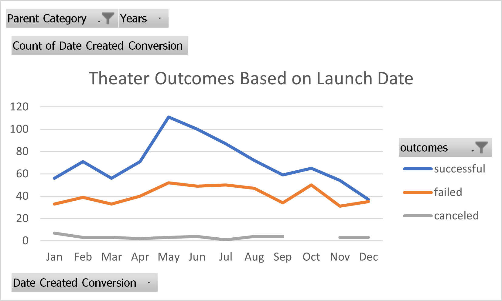

#kickstarter-analysis
# Kickstarting with Excel

## Overview of Project
>This Excel spreadsheet contains a table of various Kickstarter campaigns, their funding results, and other relevant information. The client, Louise, is interested in comparing the results of her play *Fever* to the other efforts based on launch dates and funding goals.  

### Purpose
>The purpose of this analysis is to investigate potential trends in Kickstarter campaigns that meet their goals. This information can then be used to develop a theory about possible factors that lead to succesful Kickstarter campaigns, and what strategies may be considered less effective. 

## Analysis and Challenges
>While there were no challenges that presented themselves during this exercise, there are some areas that should be paid close attention in future analyses:
	>>In the "Theater Outcomes Based on Launch Date" section, the month of October had zero canceled campaigns. However, our pivot table would           indicate that there is simply no value assigned for that month, ie NaN. While this might be acceptable for this exercise, it is entirely 		         possible that this missing value would skew results in a more in-depth analysis.
	>>In the "Outcomes Based on Goals" section, the analyst should be especially attentive to the range of each value. Quite simply, 
	inequality symbols can be tricky, and can lead to exclusion of data when using partial number values. A thorough analysis would be sure to
	include the full range of values (there should be some form of an equality on at least one end of our statement of parameters).  

### Analysis of Outcomes Based on Launch Date

>The data indicate that 'successful' and 'failed' campaigns follow similar trends based on their launch date. It would appear that the most successful outcomes in May. Since the graph is closest to inverting in December, one might conclude that the twelve month of the year is a bad time to launch a kickstarter campaign. Additionally, January campaigns have the highest chance of being canceled. The cause of this is difficult to ascertain, but may be attributed to increased spending per household during the holiday months. Conversely, this consideration fails to explain why there aren't relatively more campaigns failing to attain their goals as opposed to cancelling. Further analysis would be required to see why January campaign cancellations are roughly fifty percent more than in any other month.  

### Analysis of Outcomes Based on Goals

>From this set, we may conclude that the more backing a campaign asks for, the less successful it becomes. There is an anomaly in the range 40k to 45k, where the graphs for success and failure are inverted. There aren't sufficient data to tell us the cause of this. Perhaps campaigns in this cost range are seen as more "promising". It is also possible to assume that production efforts for plays tend to cost a fixed amount and therefore this tier gets more careful consideration by potential backers. However, any conclusions to explain the anomaly are spurious without further, more detailed analysis. 

### Challenges and Summary of Limitations
>Regarding our observations based on launch date: one option to improve our resolution would be to superimpose household spending over our graph. This would help us ascertain whether or not household spending by month (for instance, during the holiday season), has a significant effect on the outcome of a kickstarter campaign. 
>Regarding our observations based on backing goals: one variable that would improve our resolution would be one that indicates what percentage of total funding requests are represented by a given price range. Consider the possibility that the majority of campaigns are in the 40k to 45k range. If there is a significantly low sample size representing the other ranges, then our data would be heavily skewed. Indeed, understanding the "weight" of each value range would help us in forming more accurate conclusions. 

## Results
>Based solely off our given data, we would suggest that May is the best time to start a kickstarter campaign. Additionally, we might conclude that asking for less backing is generally more succesful than asking for more. 
